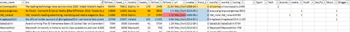

## Tweet Category Word Cloud Creation from Excel spreadsheets 

The tool categorizes the content (based on rules set by the user) and
returns an Excel document with the categorization applied. It is implemented in Java and uses the Apache POI library. All sets of operations that are outlined below are performed in less than a couple of seconds.

In particular, this program performs the next operations:
- Open the Bio Excel spreadsheet and add a filter to the top row
- Add 8 new tabs to the Excel sheet naming them: Tech; Music; CEO; Business; Youth; Media;
Sport and Blogger
- Open Category Keyword Document
- Add Category names to the filter row in the bio tab, as per the screenshot below:

- Search for keywords (one by one) in the bio filter in the Bio tab
- Add a mark (1) to the relevant category name
- Colour Code the keyword results (one color for each category e.g. sport, tech, music, etc. )
- Stagger the color for each category, so it’s clear how many categories the bio is relevant to
- Copy results into the relevant category tab
- When all keywords are filtered, tagged, coded, and copied remove duplicates from each
completed category tab (as some bios will contain more than one category keyword).
- Copy unique handles into a new excel file and save it as a CSV (One file per category)